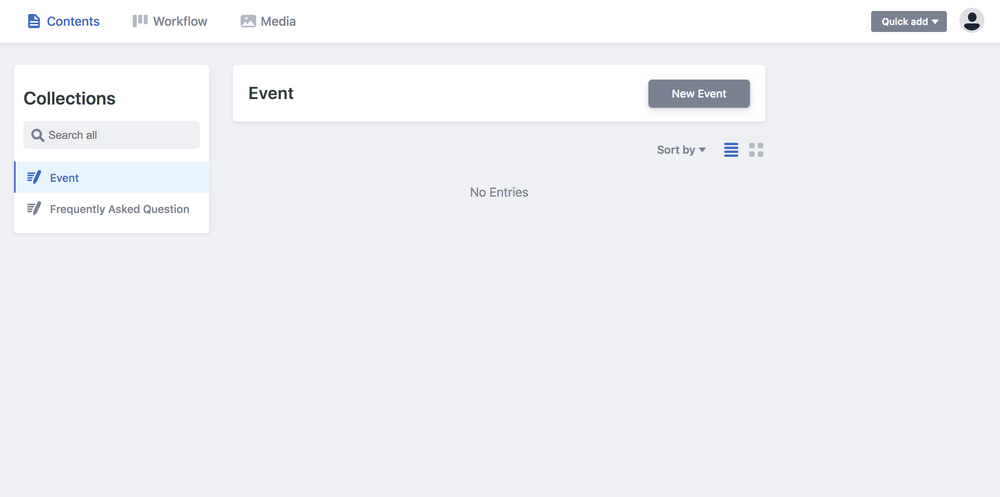

# [yettifinancial.info](https://yettifinancial.info)

## Netlify CMS

The client wanted a CMS to add events and questions to the FAQ by themselves.

I utilized open-source [Netlify CMS](https://www.netlifycms.org/) for the backend. Netlify CMS is really lightweight and easy to set up. It integrates easily with Netlify and Git Gateway, all for free. It was a breeze to work with and much preferrable to Wordpress for this use case.

This is what it looks like:

An important design feature for me was easily viewing the services and returning back to the homepage. Such smooth navigation made the website feel modern and app-like.

